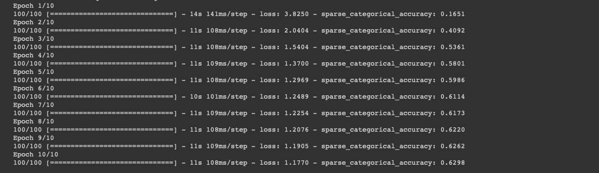
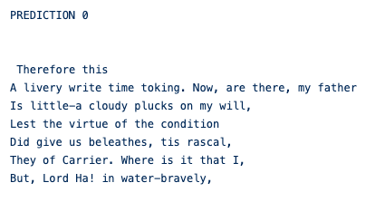
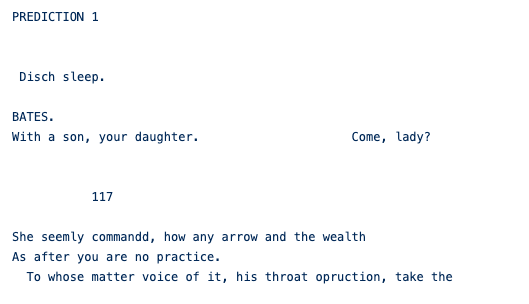
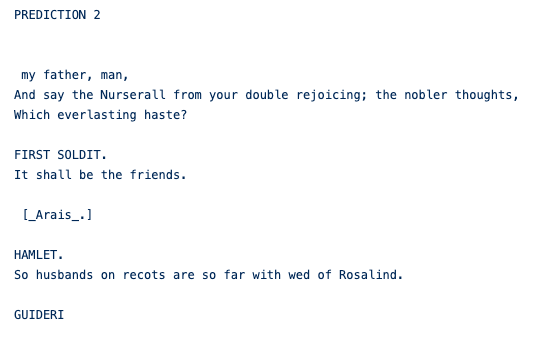

# Artificial Intlligence: Shakespeare Play Generator
This machine Learning model uses data from shakespeare's play and predicts some ai generated play identical to shakespeare!
This ML Model is based on huge amount of data, best practice is to use Tensor Processing Unit to definitely speed up the total learning process.

## Overview

This example uses [tf.keras](https://www.tensorflow.org/guide/keras) to build a language model and I trained it on a Google Cloud TPU. This language model predicts the next character of text given the text so far. The trained model can generate new snippets of text that read in a similar style to the text training data.

The model trains for 10 epochs and completes in approximately 5 minutes.

I used Python3 Google Compute Engine backend (w/ tensor processing Unit). With this I'm able to manage to get a ~65% accuracy.
Using deeper neural network (more damn layer) and multiple TPUs you can get a better result. You can also use GPUs.

These are the predictions Generated by the AI:

